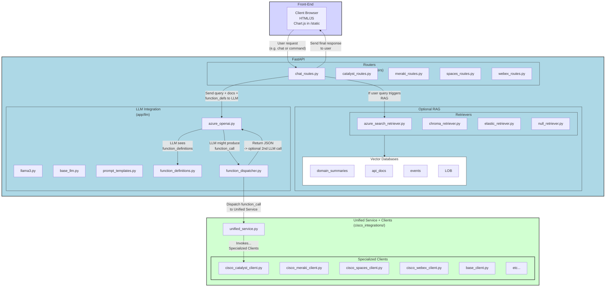
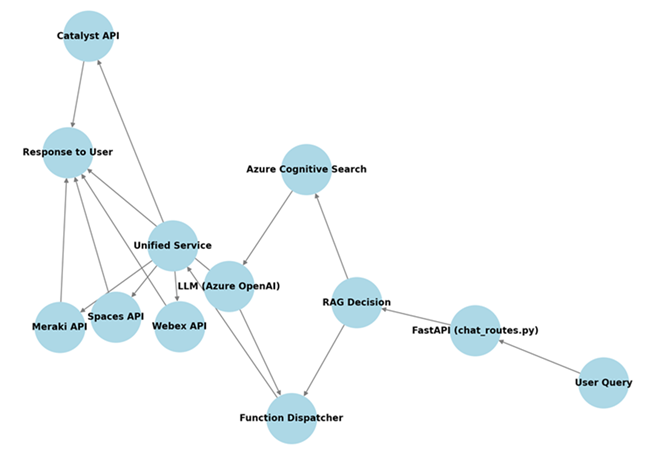

# Cisco Data Bridge AI Agent

The **Cisco Data Bridge AI Agent** integrates large language model (LLM) intelligence with multiple Cisco technologies (Meraki, Catalyst Center, Spaces, Webex, etc.), providing scalable access to network and collaboration resources. Its layered design separates front-end, back-end, retrieval, and integration logic, making it both adaptable and easy to maintain.

> **Note**: This repository is part of the [Cisco Data Bridge Project Suite](https://github.com/APO-SRE/cisco-data-bridge-project-suite).

---

## 1. Project Overview

The AI Agent in this repository acts as a sophisticated chatbot that:
- Processes user queries and determines if they need data retrieval or direct API calls.
- Optionally performs **retrieval-augmented generation (RAG)** to fetch relevant documents from vector databases (e.g., Azure Cognitive Search).
- Calls Cisco APIs through a **Function Dispatcher** and a **Unified Service** layer, which orchestrates communication with Cisco Meraki, Catalyst Center, Spaces, and Webex platforms.

### Key Components
1. **FastAPI Backend** – Serves API endpoints and routes user requests.
2. **LLM (e.g., Azure OpenAI)** – Interprets user queries and generates responses.
3. **Vector Search** (Azure Cognitive Search, Chroma, Elastic, etc.) – Retrieves relevant documents for RAG.
4. **Function Dispatcher** – Directs specific API calls based on LLM output.
5. **Cisco Integrations (Unified Service)** – Provides an abstraction layer for Meraki, Catalyst, Spaces, and Webex clients.

---

## 2. High-Level Architecture Overview

Below is a Mermaid diagram illustrating the overall structure. The **Front-End** handles user requests, which flow through **FastAPI** routes. Depending on the query, the system may perform retrieval-augmented generation (**RAG**) and/or invoke Cisco APIs through a **Function Dispatcher**. The **Unified Service** then interacts with specialized Cisco clients.



---

## 3. Cisco AI Agent Decision Flow



---

## 4. Step-by-Step Decision Flow: Determining Which Cisco Platform & API to Call

When a user submits a query, the agent decides whether to perform document retrieval (RAG) or call a specific Cisco API. Below is a high-level outline of how the system determines the right course of action:

1. **User sends a query** via FastAPI (`chat_routes.py`).
2. **Vector Search Decision**:  
   - If the query is informational, the system queries the vector database (e.g., Azure Cognitive Search, Chroma) for relevant documents.  
   - Results are fed into the LLM for context.
3. **LLM Decision**:  
   - If the user’s request requires real-time data (e.g., “Show me the Meraki networks”), the LLM decides which Cisco service or function is needed.
4. **Function Dispatcher** (`function_dispatcher.py`)  
   - Receives the function name from the LLM’s structured `function_call`.
   - Routes the request to the correct method in the **Unified Service**.
5. **Unified Service** (`unified_service.py`)  
   - Acts as a single interface for all Cisco clients (Meraki, Catalyst, Spaces, Webex).  
   - Invokes the appropriate specialized client (e.g., `CiscoMerakiClient`).
6. **Cisco Clients** (e.g., `cisco_meraki_client.py`)  
   - Interact directly with the respective Cisco product’s REST APIs.
7. **Response** is packaged and returned to the user.

| Component                                    | Role                                                                      |
|----------------------------------------------|---------------------------------------------------------------------------|
| **FastAPI & LLM Routers**                    | Receives requests, determines if retrieval or API call is needed         |
| **Chat Router (`chat_routes.py`)**           | Main entry point for user queries; decides between RAG or function calls |
| **Function Dispatcher (`function_dispatcher.py`)** | Executes the correct API function based on the LLM's instructions   |
| **Unified Service (`unified_service.py`)**   | Abstracts Meraki, Catalyst, Spaces, and Webex clients                    |
| **Platform Clients**                         | Low-level API interaction with Cisco services                            |

---

## 5. Detailed Component Descriptions

### 5.1 Front-End (Static HTML/JS)
- **Location**: `static/` folder  
- **Purpose**: Demonstrates basic agent functionality for chatting and optionally displaying visualizations (e.g., using Chart.js).  
- **Communication**: Interacts with FastAPI endpoints via REST calls.  
- **Flexibility**: Can be replaced by a production-ready front-end (e.g., a React app).

### 5.2 Back-End (FastAPI & Routers)
- **Main Entry Point**: `app/main.py`
- **Routers** (in `app/routers/`):
  - `chat_routes.py` – Handles chat queries, routes them for retrieval or function calls.
  - `catalyst_routes.py` – Routes requests to Cisco Catalyst (DNA Center) APIs.
  - `meraki_routes.py` – Routes requests to Cisco Meraki APIs.
  - `spaces_routes.py` – Routes requests to Cisco Spaces APIs.
  - `webex_routes.py` – Routes requests to Cisco Webex APIs.
- **Flow**:
  1. Receives HTTP requests from the front-end.
  2. Decides whether RAG is needed (i.e., fetch domain docs from retrievers).
  3. Sends user query + docs to the LLM.
  4. Interprets LLM output; if a `function_call` is present, delegates to **Function Dispatcher**.
  5. Returns the final response to the user.

### 5.3 LLM Integration (`app/llm/`)
- **Core Files**:  
  - `azure_openai.py`, `llama3.py`, `base_llm.py`  
  - `prompt_templates.py` – Defines how prompts and contexts are structured.  
  - `function_definitions.py` – Declares each “tool” or “function” the LLM can call, including JSON parameter schemas.  
  - `function_dispatcher.py` – The **Function Dispatcher** that executes the correct method in the Unified Service or specialized Cisco clients based on the LLM’s structured output.
- **Workflow**:
  1. The LLM processes user input, optionally enriched with context from the retrieval layer.
  2. If the LLM decides an API call is needed, it returns a structured `function_call`.
  3. The Function Dispatcher looks up the matching function in `function_definitions.py` and executes it, returning the result to the LLM or directly to the user.

### 5.4 Retrieval Layer (`retrievers/`)
- **Purpose**: Implements *retrieval-augmented generation* (RAG).
- **Files**:  
  - `azure_search_retriever.py`, `chroma_retriever.py`, `elastic_retriever.py`, `null_retriever.py`
- **How It Works**:
  1. The system checks if the user’s query needs domain-specific context (e.g., product documentation, knowledge articles).
  2. If so, relevant documents are fetched from the configured vector database (Azure Cognitive Search, Chroma, or Elastic).
  3. These documents are then passed to the LLM as context to improve response accuracy.

### 5.5 Cisco Integrations (`cisco_integrations/`)
- **Specialized Clients**:
  - `cisco_catalyst_client.py`
  - `cisco_meraki_client.py`
  - `cisco_spaces_client.py`
  - `cisco_webex_client.py`
- **Base Class**: `base_client.py` – provides a standard interface for authentication, error handling, and retries.
- **Unified Service** (`unified_service.py`):
  - Wraps all Cisco product interactions in a single interface.
  - Centralizes authentication and request management.
  - Handles platform differences so the rest of the application remains consistent.

### 5.6 Function Dispatcher (`function_dispatcher.py`)
- **Role**: Bridges the gap between LLM-intent and actual Python function calls.
- **Process**:
  1. Receives a JSON-based `function_call` from the LLM (as defined in `function_definitions.py`).
  2. Identifies which function to invoke (e.g., `get_meraki_networks`, `get_catalyst_device_by_id`).
  3. Calls the corresponding method in `unified_service.py` (e.g., `UnifiedService.get_meraki_networks()`).
  4. Returns the data to the LLM or routes the final response back to the user.

---

## 6. Why This Architecture?

1. **Clear Separation of LLM & Retrieval**  
   - The main application decides if domain documents are needed. The LLM focuses on using the retrieved data, keeping knowledge management and AI logic cleanly isolated.

2. **Function Dispatcher Pattern**  
   - Streamlines how `function_call` requests from the LLM are executed. Instead of multiple `if/else` statements, each function is declared with a name, description, and JSON schema, and the dispatcher invokes it automatically.

3. **Unified Cisco Service**  
   - Centralizes API interactions for Catalyst, Meraki, Spaces, and Webex. This ensures consistent authentication, logging, and error handling across all platforms.

4. **Front-End/Back-End Split**  
   - The UI is decoupled from business logic and LLM integration. You can replace the static front-end with any modern framework (React, Angular, Vue) without affecting the back-end.

5. **Extensibility**  
   - Add new Cisco platforms, vector databases, or LLM providers with minimal code changes. You can also integrate advanced AI usage scenarios (e.g., combining design knowledge, best practices, deployment scripts) to achieve automated provisioning at CCNP level or beyond.

---

## 7. Extensibility: Supporting More LLMs, Vector Databases, and Cisco Platforms

- **Modular LLM Support**: Azure OpenAI, Llama 3, or any new LLM can be plugged into `app/llm/`.
- **Flexible Vector Database Integration**: Swap between Azure Cognitive Search, Chroma, Elastic, or any other vector store in `retrievers/`.
- **Additional Cisco Platforms**: Extend `unified_service.py` and add new specialized clients for platforms like Nexus Dashboard, Nexus Hyperfabric, XDR, and more.

---

## 8. Getting Started

If you’re new to this project or to Python/Git in general, check out our [Beginner’s Guide](./GETTING_STARTED.md) for step-by-step setup and deployment instructions. It covers local development on a laptop (e.g., Docker, AKS on UCS), configuration details, and tips on how to quickly experiment with Generative AI in a Cisco environment.

---

## Final Notes

- The **AI Agent** can be deployed in various environments:
  - **Production**: Kubernetes (AKS on UCS) or any container orchestration platform.
  - **Development/Testing**: Run on a single engineer’s laptop to learn how Generative AI interacts with Cisco platforms.
- Future releases (mid-April and beyond) plan to include:
  - Expanded LLM options for improved flexibility.
  - Additional vector database integrations.
  - Enhanced function definitions to support more complex use cases.

By leveraging Cisco’s core networking assets and complementing them with advanced AI capabilities, this project aims to deliver high-value, differentiated solutions across multiple industries and use cases.
```
