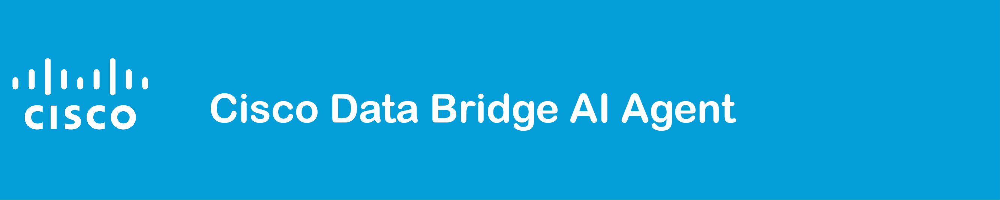
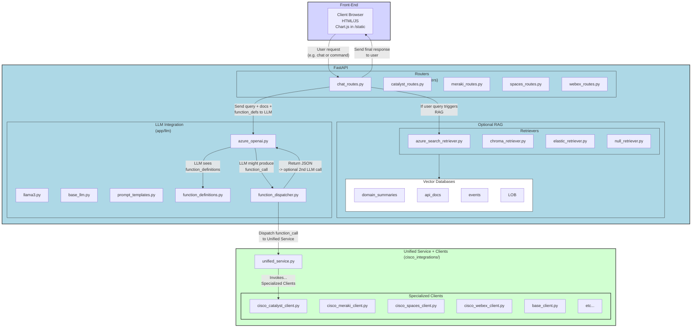

The Cisco Data Bridge AI Agent integrates large language model intelligence with multiple Cisco technologies, offering scalable access to network and collaboration resources. Its layered structure separates front-end, back-end, retrieval, and integration logic, making it adaptable and easy to maintain.

**This repo is part of the [Cisco Data Bridge Project Suite](https://github.com/APO-SRE/cisco-data-bridge-project-suite).**

---

### High-Level Architecture Overview



---

### Key Architectural Highlights

#### Front-End (Static HTML/JS)
- **Location**: `static/` folder  
- **Purpose**: Demonstrates the agent’s functionality with a simple UI for chatting and optional visualizations.  
- **Communication**: Interacts with the FastAPI endpoints via REST calls.  
- **Flexibility**: Can be replaced or expanded for production deployments.

#### Back-End (FastAPI)
- **Definition**: Found in `app/main.py` and multiple routers in `app/routers/`. Examples include:
  - `catalyst_routes.py`
  - `chat_routes.py`
  - `meraki_routes.py`
  - `spaces_routes.py`
  - `webex_routes.py`
- **Responsibilities**:  
  1. Receives requests from the front-end  
  2. Optionally performs retrieval-augmented generation (RAG) by pulling relevant documents from various vector databases (`retrievers/`)  
  3. Passes user queries and relevant docs to the LLM  
  4. If the LLM decides to invoke a Cisco function, `chat_routes.py` delegates the request to a **function dispatcher** for actual execution  
  5. Returns the final response to the client  
- **Scalability**: Easily containerized for Docker or Kubernetes.

#### LLM Integration (`app/llm/`)
- **Logic Storage**: Contains code that communicates with large language models (e.g., Azure OpenAI).  
- **Prompt Templates & Function Definitions**:  
  - **Prompt Templates** guide how context is provided to the LLM.  
  - **function_definitions.py** defines each “tool” or “function” the LLM can call, specifying the name, description, and JSON schema for parameters.  
- **Function Dispatcher**:  
  - When the LLM returns a structured `function_call`, the dispatcher executes the correct method in `unified_service.py` to retrieve real data from Cisco APIs.

#### Retrieval Layer (`retrievers/`)
- **RAG Functionality**: Implements *retrieval-augmented generation* by fetching relevant data from enterprise sources *before* each LLM query, if needed.  
- **Multiple Options**: Azure Search, Elastic, or Chroma can be used to vectorize and search domain documents.

#### Cisco Integrations (`cisco_integrations/`)
- **Specialized Clients**: Classes like `cisco_catalyst_client.py`, `cisco_meraki_client.py`, `cisco_spaces_client.py`, `cisco_webex_client.py` handle the respective Cisco product’s REST APIs.  
- **Base Class Inheritance**: All clients extend `BaseCiscoClient` for consistent error handling, authentication, and retries.  
- **Unified Service**: `unified_service.py` orchestrates calls to each specialized client, providing a single interface for the rest of the application.

---

### Why This Architecture?

1. **LLM & Retrieval Separation**  
   The main application *decides* whether to retrieve domain data, while the LLM focuses on *using* that data. This cleanly isolates large language model usage from enterprise search concerns.

2. **Function Dispatcher**  
   The dispatcher pattern streamlines how function calls from the LLM are executed in Python. Instead of crowding `chat_routes.py` with “if function == X, call Y,” each function is declared in **function_definitions.py** (the “schema”), and the dispatcher runs the correct code in `unified_service.py` or the specialized Cisco clients.

3. **Unified Cisco Service**  
   All Cisco product interactions pass through `unified_service.py`, ensuring consistent authentication, logging, and error handling. Each product (Catalyst, Meraki, Spaces, Webex) can be swapped or extended without breaking the rest of the application.

4. **Front/Back-End Split**  
   The UI is decoupled from the LLM and Cisco integrations. You can update the front-end independently (a React dashboard, a CLI tool, or a new web app), while the back-end logic and integration remain stable.

Overall, the **two-step function-calling approach** (LLM → function call → dispatcher → summary) and **modular retrieval** give teams a stable, enterprise-ready foundation that can scale to new data sources, new Cisco products, or advanced AI usage scenarios.
```
## Getting Started

If you’re a first-time user or new to Git/Python, please see our [Beginner’s Guide](./GETTING_STARTED.md) for step-by-step instructions.
 